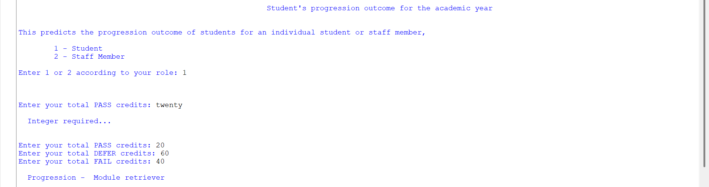
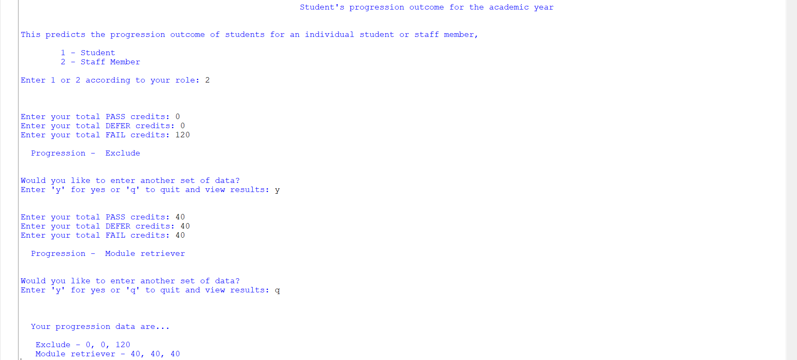
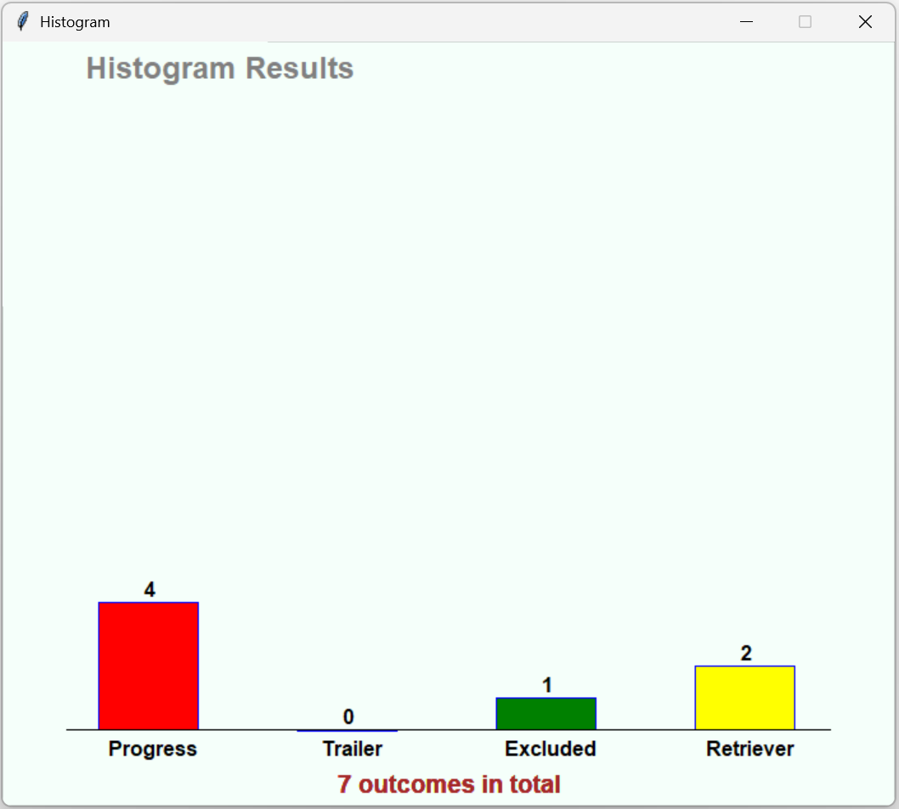

# Student Progression Outcome Predictor

A Python application that predicts student progression outcomes based on academic credits with visualization capabilities.

## Project Description

This application allows students and staff members to predict progression outcomes at the end of each academic year. It takes input of PASS, DEFER, and FAIL credits and determines the student's progression status according to university regulations.

The system analyzes the entered credit values and categorizes students into one of four progression outcomes:
- Progress
- Progress (module trailer)
- Module retriever
- Exclude

For staff users, the application provides additional functionality to process multiple students and generate statistical visualizations.

## Features

- User role selection (Student or Staff)
- Credit validation with appropriate error handling
- Immediate progression outcome prediction
- Visual histogram representation of progression statistics (for staff)
- Data storage in a text file for record keeping
- Interactive graphical interface for results visualization

## Files

- `main.py` - The main application that contains all functionality
- `graphics.py` - Supporting module for graphical representations (required dependency)
- `Progression_data.txt` - Auto-generated file that stores progression records

## How to Use

1. Run the Python file:
   ```
   python main.py
   ```

2. Select your role (1 for Student, 2 for Staff)

3. Enter the required credit information:
   - PASS credits
   - DEFER credits
   - FAIL credits

4. View the predicted progression outcome

5. For staff users:
   - Process multiple students by entering 'y' when prompted
   - View statistical histogram by entering 'q' when finished
   - Review saved progression data in the text file

## Credit Validation Rules

- Credits must be entered as integers
- Valid credit values are: 0, 20, 40, 60, 80, 100, 120
- Total credits must equal 120 for a valid submission

## Progression Outcome Rules

- **Progress**: 120 PASS credits
- **Progress (module trailer)**: 100 PASS credits and 20 DEFER or FAIL credits
- **Exclude**: 80-120 FAIL credits with ≤40 PASS and ≤40 DEFER credits
- **Module retriever**: All other valid combinations

## Screenshots

### User Interface and Credit Input

*Role selection and credit input interface*

<div style="display: flex; justify-content: space-between;">
  
  
</div>

### Results Visualization

*Graphical histogram showing progression outcome statistics*



## Requirements

- Python 3.x
- graphics.py module

